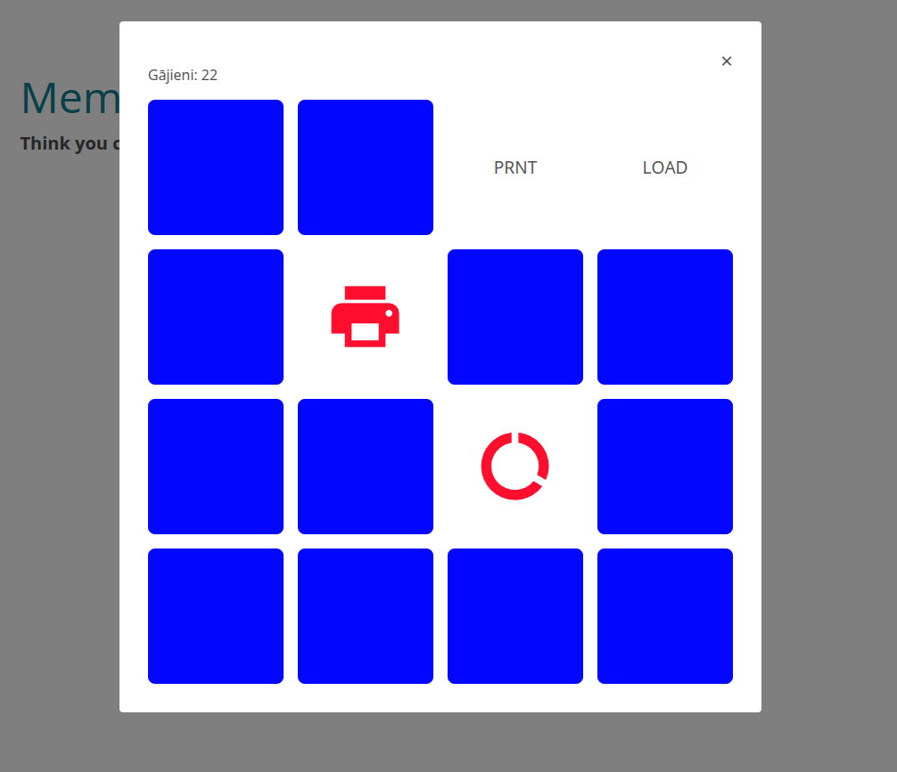

Associative memory game that requires user to match image with the correct text statement.



Primary color corresponds to svg asset fill='currentColor'.
Secondary color corresponds to tile back color.


Component has some issues that needs to be adressed in case if required.
    1. Some field sizes, besides 4X4  will not work. Address in JS if necessary.
    2. Text and highlight colors no longer associated with anything.


When adding custom SVG via Authoring tool, make sure to use HTML edit in CKeditor and allow all HTML tags in CKEditor config:
nano path to adapt_authoring/conf/config.json
find and edit:
```
"ckEditorHtmlSupport": {
  "allow": [
    {
      "name": ".*",
      "attributes": true,
      "classes": true,
      "styles": true
    }
  ]
}
```

Flipping, correct match and component completion sounds can be added via assets.